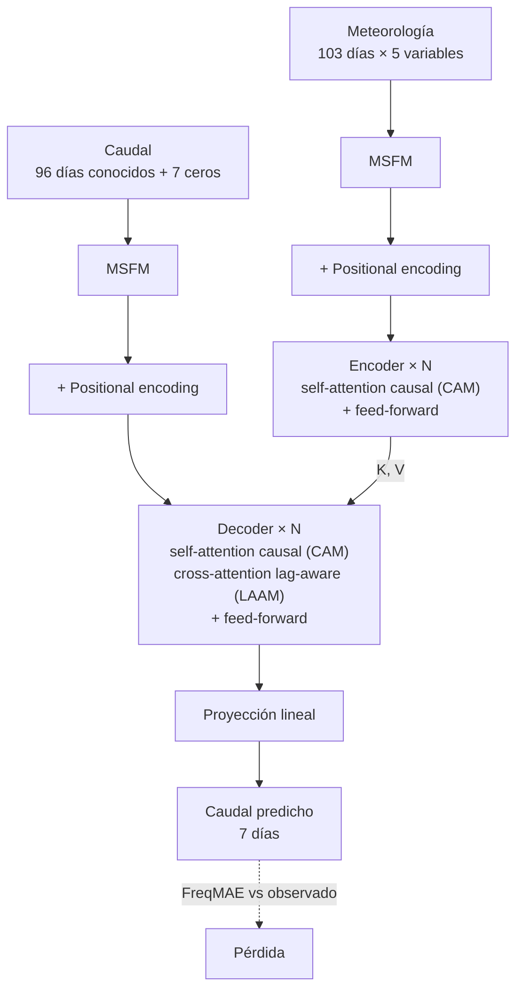
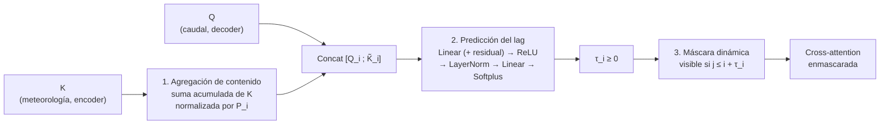
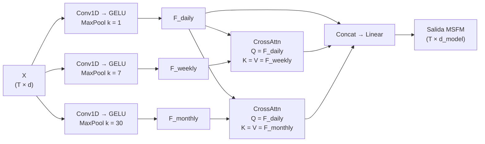

# Resumen del paper: CLAMF-Former

> **Enhancing runoff prediction with causal lag-aware attention and multi-scale fusion in transformer models**
> Weiheng Yuan & Hua Yan — *Journal of Hydrology* 664 (2026) 134369 — [doi:10.1016/j.jhydrol.2025.134369](https://doi.org/10.1016/j.jhydrol.2025.134369)
> PDF original: [`paper.pdf`](paper.pdf)

Este documento resume el paper para el equipo. Cada aporte se explica primero **en términos sencillos**
y luego **al nivel de detalle del paper** (ecuaciones y hiperparámetros). Al final de cada sección hay un
apartado **"Lo que el paper no especifica"**, con los huecos que tendremos que resolver al implementar.
Las decisiones que tomemos se registran en [`decisions.md`](decisions.md).

## Índice

1. [TL;DR](#1-tldr)
2. [Motivación: el problema de la atención clásica](#2-motivación-el-problema-de-la-atención-clásica)
3. [Arquitectura general](#3-arquitectura-general)
4. [Aporte 1 — CLAAM: atención causal y lag-aware](#4-aporte-1--claam-atención-causal-y-lag-aware)
5. [Aporte 2 — MSFM: fusión multi-escala](#5-aporte-2--msfm-fusión-multi-escala)
6. [Aporte 3 — FreqMAE: pérdida en el dominio de la frecuencia](#6-aporte-3--freqmae-pérdida-en-el-dominio-de-la-frecuencia)
7. [Setup experimental](#7-setup-experimental)
8. [Resultados y ablaciones](#8-resultados-y-ablaciones)
9. [Limitaciones según los autores](#9-limitaciones-según-los-autores)
10. [Huecos de especificación generales](#10-huecos-de-especificación-generales)

---

## 1. TL;DR

- **Tarea:** predecir el caudal (*runoff*) de un río en los **próximos 7 días** usando los **96 días
  anteriores** de caudal y variables meteorológicas (precipitación, radiación, temperaturas, presión de vapor).
- **Modelo:** **CLAMF-Former** (*Causal Lag-Aware attention with Multi-scale Fusion Transformer*), un
  Transformer encoder–decoder con tres cambios:
  1. **CLAAM**: la atención no puede "mirar al futuro" dentro de una misma serie (**causal**), y la
     atención entre caudal y meteorología aprende **cuántos días de desfase** (lag) mirar.
  2. **MSFM**: antes de entrar al Transformer, cada serie se resume a escala **diaria, semanal y mensual**
     y las tres vistas se fusionan.
  3. **FreqMAE**: la pérdida compara el **espectro de Fourier** de la predicción con el del valor observado,
     en lugar de comparar punto por punto en el tiempo.
- **Resultado:** frente al mejor baseline Transformer, mejora el NSE **11.56 % en media** y **3.28 % en
  mediana** sobre 241 cuencas de CAMELS (EE. UU.).

---

## 2. Motivación: el problema de la atención clásica

### En términos sencillos

En la self-attention clásica, cada día de la serie puede "mirar" a **todos** los demás días, incluidos los
posteriores. En traducción automática eso tiene sentido (el contexto completo de la frase ayuda), pero en
hidrología no: el caudal de hoy **no puede depender** del caudal de mañana. Si el modelo aprende esas
relaciones, aprende correlaciones espurias.

Además, la respuesta del río a la lluvia **no es instantánea**: el agua tarda en infiltrarse, escurrir
o derretirse, y esos retrasos varían. La atención clásica no tiene ningún mecanismo para modelar ese desfase.

### Detalle del paper (Sec. 2.1)

Dada una secuencia de queries $X \in \mathbb{R}^{n \times d}$ y de keys $Y \in \mathbb{R}^{m \times d}$,
la matriz de pesos de atención es (Eq. 1):

$$
A = \operatorname{softmax}\!\left(\frac{QK^\top}{\sqrt{d_k}}\right) \in \mathbb{R}^{n \times m}
$$

> El paper llama $V$ a esta matriz. Aquí usamos $A$ para no confundirla con los *values*.

La fila $i$ indica cuánto atiende la posición $i$ (un día) a cada posición $j$. Los autores entrenaron
**RR-Former** (el primer Transformer para *rainfall-runoff*) y analizaron sus matrices de atención (Fig. 2).
Encontraron tres problemas:

1. **Falta de causalidad:** en la self-attention del encoder y del decoder hay pesos significativos en el
   triángulo superior ($j > i$): el día $i$ usa información de días futuros.
2. **Cross-attention físicamente implausible:** la atención caudal→meteorología se concentra en un tramo
   fijo (días 80–100) para cualquier query, en lugar de seguir una relación dinámica con desfase.
3. **Bandas verticales:** en todas las matrices, casi todas las queries atienden a las mismas pocas
   posiciones. El modelo depende de unos pocos puntos y no capta la estructura global.

La causa, según los autores, es que la arquitectura se heredó de NLP sin adaptarla. Informer, Autoformer,
iTransformer, RR-Former y DTSW-transformer mantienen el mismo encoder no causal.

---

## 3. Arquitectura general

### En términos sencillos

Es un Transformer encoder–decoder clásico:

- el **encoder** lee la **meteorología**;
- el **decoder** lee el **caudal histórico**, con los 7 días a predecir rellenados con ceros;
- el decoder consulta al encoder mediante cross-attention.

Los tres aportes se insertan en puntos concretos de ese esquema.

### Detalle del paper (Sec. 2.2.1, Fig. 3)



Componentes (en orden):

1. **MSFM** en la entrada del encoder (meteorología) **y** del decoder (caudal).
2. **Positional encoding** sumado a la salida del MSFM.
3. **N capas de encoder y N de decoder** ($N = 4$). Frente al Transformer clásico:
   - self-attention del encoder → **atención causal (CAM)**;
   - self-attention del decoder → **atención causal (CAM)**, igual que en el Transformer clásico;
   - cross-attention del decoder → **atención lag-aware (LAAM)**.

   CAM + LAAM forman el **CLAAM**.
4. **Proyección lineal** a la salida del decoder.
5. Entrenamiento con **FreqMAE**.

---

## 4. Aporte 1 — CLAAM: atención causal y lag-aware

### En términos sencillos

El CLAAM tiene dos partes:

- **Atención causal (CAM):** dentro de una misma serie, el día $i$ solo puede mirar los días $0 \dots i$.
  Se consigue con una máscara que "tapa" el futuro. No es nueva, pero hasta ahora solo se usaba en el
  decoder; el paper también la aplica al **encoder**.
- **Atención lag-aware (LAAM):** cuando el caudal consulta la meteorología, el modelo **predice un desfase
  $\tau_i$** para cada día y le deja ver la meteorología hasta $i + \tau_i$. Así la ventana de visibilidad
  no queda fija: la aprende el modelo, posición por posición.

Ejemplo con $T = 5$ (1 = visible, 0 = tapado):

```
Máscara causal (CAM)               Máscara lag-aware (LAAM), τ = (1, 0, 2, 1, 0)
       j: 0 1 2 3 4                       j: 0 1 2 3 4
  i = 0:  1 0 0 0 0                  i = 0:  1 1 0 0 0    (ve hasta j = 0 + 1)
  i = 1:  1 1 0 0 0                  i = 1:  1 1 0 0 0    (ve hasta j = 1 + 0)
  i = 2:  1 1 1 0 0                  i = 2:  1 1 1 1 1    (ve hasta j = 2 + 2)
  i = 3:  1 1 1 1 0                  i = 3:  1 1 1 1 1    (ve hasta j = 3 + 1)
  i = 4:  1 1 1 1 1                  i = 4:  1 1 1 1 1    (ve hasta j = 4 + 0)
```

### 4.1 Atención causal — CAM (Sec. 2.2.2)

Se implementa con la máscara estándar del Transformer, en forma aditiva sobre los logits:

$$
M^{\text{causal}}_{ij} =
\begin{cases}
0 & \text{si } j \le i \\
-\infty & \text{si } j > i
\end{cases}
\qquad
\operatorname{Attn}(Q, K, V) = \operatorname{softmax}\!\left(\frac{QK^\top}{\sqrt{d_k}} + M\right) V
$$

Se aplica en la self-attention del **encoder** (meteorología) y del **decoder** (caudal).

### 4.2 Atención lag-aware — LAAM (Sec. 2.2.2, Fig. 4)

Reemplaza la cross-attention del decoder: las queries $Q$ vienen del caudal (decoder) y las keys/values
$K, V$ de la meteorología (salida del encoder). Una pequeña **red causal lag-aware** predice $\tau_i$ en
tres pasos:



**Paso 1 — Agregación de contenido (Eq. 2 y 3).** Se resume la historia de las keys hasta la posición
$i$ y se normaliza para que las posiciones tardías no acumulen magnitudes enormes:

$$
\tilde{K}_i = \frac{\sum_{j=0}^{i} K_j}{P_i + \epsilon}
\qquad\qquad
Z_i = \operatorname{Concat}\left(Q_i, \tilde{K}_i\right)
$$

donde $P_i$ es, según el paper, la "codificación posicional" de la posición $i$ y $\epsilon$ una constante
pequeña de estabilidad numérica. En la Fig. 4(b) la agregación es una suma acumulada de $K$ seguida de un
bloque "/ Positional Encoding".

**Paso 2 — Predicción del lag (Eq. 4).** Un MLP con conexión residual y LayerNorm predice un desfase
positivo para cada posición. La fórmula, tal como aparece en el PDF:

$$
\tau_i = \operatorname{Softplus}\Big(W_2 \cdot \operatorname{LayerNorm}\big(\operatorname{ReLU}(W_1 Z_i + b_1 + Z_i)\big) + b_2\Big),
\qquad \tau_i \in \mathbb{R}^{+}
$$

Softplus es una aproximación suave de ReLU y garantiza $\tau_i > 0$. La Fig. 4(b) muestra el mismo orden
que la ecuación: `FC1 → (+ Z) → ReLU → LayerNorm → FC2 → Softplus`, con un escalar $\tau_i$ por posición.

**Paso 3 — Máscara causal dinámica (Eq. 5).** La máscara causal permite $[0, i]$; la máscara lag-aware
extiende la ventana a $[0, i + \tau_i]$:

$$
\text{Mask}_{ij} =
\begin{cases}
1 & \text{si } j \le i + \tau_i \quad \text{(visible)} \\
0 & \text{en otro caso} \quad \text{(tapado)}
\end{cases}
$$

> **Nota.** Como la meteorología de toda la ventana (incluidos los 7 días a predecir) es una entrada
> conocida, que la posición $i$ del caudal vea meteorología en $i + \tau_i$ **no filtra el target**. Lo que
> la causalidad prohíbe es que el caudal vea caudal futuro, y eso lo garantiza el CAM del decoder.

### 4.3 Qué cambia en la práctica (Fig. 9)

Con el CLAAM, las matrices de atención:

- tienen el triángulo superior en **cero** en la self-attention (causalidad estricta);
- en la cross-attention muestran una **banda diagonal**: el caudal atiende sobre todo a la meteorología
  del mismo día o de días cercanos, lo que es físicamente razonable;
- **no presentan bandas verticales**: la atención se reparte sobre toda la historia.

### 4.4 Lo que el paper no especifica

- **⚠️ Diferenciabilidad de la máscara.** Con una máscara binaria $j \le i + \tau_i$ la red que predice
  $\tau$ no recibe gradiente, así que no aprendería. El paper no dice cómo lo resuelve. **Resuelto en
  [`decisions.md`](decisions.md) D-001:** usamos una máscara suave diferenciable.
- **Qué es $P_i$ en la Eq. 2.** El texto habla de "positional encodings", pero dividir un vector por un
  encoding sinusoidal no tiene una interpretación clara. **Resuelto en D-009:** $P_i = i + 1$, así que
  $\tilde{K}_i$ es la **media acumulada** de las keys (la única lectura que cumple el propósito declarado de
  que las magnitudes no crezcan con la posición).
- **Paréntesis y residual en la Eq. 4.** El residual va dentro del ReLU
  ($\operatorname{ReLU}(W_1 Z_i + b_1 + Z_i)$), no después como sería lo habitual. La Fig. 4(b) lo
  confirma, así que no es una errata. **Resuelto en D-009:** se implementa literal; $W_1$ es cuadrada
  ($2d \to 2d$) y $W_2$ proyecta a un escalar.
- **$\tau$ por head o compartido.** Ni la Eq. 4 ni la Eq. 5 llevan índice de head. **Resuelto en D-009:**
  un solo $\tau_i$ por posición, compartido entre heads, y una red de $\tau$ por capa del decoder.
- **Unidades y redondeo de $\tau$:** se interpreta en pasos de tiempo (días), pero $\tau_i$ es continuo y el
  paper no dice si se redondea. Con la máscara suave de D-001 no hace falta redondearlo.
- **Qué $Q$ y $K$ se usan:** si la red de $\tau$ usa las keys ya proyectadas por head ($d_k$) o la salida del
  encoder sin proyectar ($d_{model}$). **Resuelto en D-009:** sin proyectar, como las entradas $Q, K$ de la
  multi-head attention de la Fig. 4(a): el estado del decoder y la salida del encoder.

---

## 5. Aporte 2 — MSFM: fusión multi-escala

### En términos sencillos

El caudal de un río tiene patrones a distintas escalas: eventos de un día (una tormenta), dinámicas
semanales y tendencias mensuales o estacionales (deshielo, época seca). El MSFM construye **tres versiones
de la serie** —diaria, semanal y mensual— y deja que la versión diaria **"consulte"** a las otras dos con
atención. Así, cada día llega al Transformer enriquecido con el contexto de su semana y de su mes.

### Detalle del paper (Sec. 2.2.3, Fig. 5)



**Descomposición multi-escala (Eq. 6–9).** Dada una serie $X \in \mathbb{R}^{T \times d}$, tres ramas
paralelas:

$$
\operatorname{ScaleExtraction}_k(X) = \operatorname{MaxPool}_{k}\Big(\operatorname{GELU}\big(\operatorname{Conv1D}_{d \to d_{\text{fusion}}}(X)\big)\Big)
$$

$$
F_{\text{daily}} = \operatorname{ScaleExtraction}_{1}(X), \quad
F_{\text{weekly}} = \operatorname{ScaleExtraction}_{7}(X), \quad
F_{\text{monthly}} = \operatorname{ScaleExtraction}_{30}(X)
$$

Con $k = 1$ el MaxPool es la identidad y la serie conserva la resolución diaria. Con $k = 7$ y $k = 30$ la
serie se acorta (≈ $T/7$ y $T/30$ pasos).

La Fig. 5 dibuja un Conv1d distinto (otro color) en cada rama, seguido de GELU y
"MaxPool (kernel size = 1 / 7 / 30)", con `F_weekly` y `F_monthly` más cortas que `F_daily`.

**Fusión multi-escala (Eq. 10–12).** Las escalas gruesas se alinean a la resolución diaria con
cross-attention, usando la escala diaria como query:

$$
\hat{F}_{\text{weekly}} = \operatorname{CrossAttention}(F_{\text{daily}}, F_{\text{weekly}}, F_{\text{weekly}}),
\qquad
\hat{F}_{\text{monthly}} = \operatorname{CrossAttention}(F_{\text{daily}}, F_{\text{monthly}}, F_{\text{monthly}})
$$

$$
\operatorname{Output} = \operatorname{Linear}\Big(\operatorname{Concat}\big[F_{\text{daily}}, \hat{F}_{\text{weekly}}, \hat{F}_{\text{monthly}}\big]\Big)
$$

Todas las salidas tienen longitud $T$. El concat da $T \times 3d_{\text{fusion}}$ y el Linear lo proyecta a
la dimensión del modelo. En el paper, $d_{\text{fusion}} = d_{\text{model}} = 64$.

En la Fig. 5 la fusión son **dos bloques "Multi-Head Attention" separados** (Q = `F_daily`, K = V = la
escala gruesa), **sin "Add & Norm"**, a diferencia de las atenciones de la Fig. 3. La Fig. 3 dibuja un MSFM
en el encoder y otro en el decoder, y el positional encoding se suma **después** del MSFM.

### Lo que el paper no especifica

- **⚠️ Causalidad del MSFM.** Un Conv1D con padding simétrico, un MaxPool de ventana 7 o 30 o una
  cross-attention sin máscara hacen que el día $i$ vea información de días futuros. Eso **contradice la
  causalidad** que el CLAAM impone después. Es especialmente delicado en el decoder, donde la entrada es
  el propio caudal. La Fig. 5 sugiere MaxPool con stride $= k$ y fusión sin máscara. **Decidido en
  D-005:** se implementa literal (no causal); no hay fuga del target porque el horizonte entra en ceros.
- **Kernel size, stride y padding** de Conv1D y MaxPool. **Resuelto en D-005 y D-010:** Conv1D con
  kernel 3 y padding simétrico de ceros; MaxPool con stride $= k$. El problema de $T = 103$ (no divisible
  por 7 ni por 30) desaparece con 384 pasos y $k = 24, 96$ (D-002).
- **Pesos compartidos o no** entre las tres ramas y entre el MSFM del encoder y el del decoder.
  **Resuelto en D-010:** no se comparte nada (la Fig. 5 dibuja bloques distintos).
- **Configuración de la cross-attention de fusión:** número de heads, si lleva residual/LayerNorm, y si
  usa máscara. **Resuelto en D-005 y D-010:** 4 heads, sin residual ni LayerNorm, sin máscara y sin
  positional encoding (se suma después del MSFM).
- **Dimensión de salida del Linear**: en el paper coincide con $d_{\text{fusion}}$. **Resuelto en D-010:**
  $3d_{\text{fusion}} \to d_{\text{model}}$.
- **Decoder con una sola variable:** el decoder recibe solo el caudal ($d = 1$), así que el Conv1D pasa de 1
  a 64 canales. No requiere tratamiento especial (D-010).
- **Qué reemplaza al MSFM en las ablaciones "sin MSFM".** El paper no lo dice. **Resuelto en D-010:** un
  `Linear(d → d_model)` por entrada, igual que en el Transformer vanilla.

---

## 6. Aporte 3 — FreqMAE: pérdida en el dominio de la frecuencia

### En términos sencillos

Una serie temporal se puede describir como una suma de ondas de distintas frecuencias: tendencias lentas
(frecuencias bajas) y cambios bruscos o picos (frecuencias altas). El MAE clásico compara la predicción con
el valor real **día a día**. FreqMAE compara **qué ondas** tiene cada serie y **con qué intensidad**, por
lo que obliga a la predicción a tener la misma "forma" que la serie observada (oscilaciones, picos y
tendencia), no solo valores cercanos en promedio.

### Detalle del paper (Sec. 2.2.4)

**Fundamento — teorema de Parseval (Eq. 13):** la energía de una señal es la misma en el tiempo y en la
frecuencia.

$$
\sum_{n=0}^{N-1} \lvert x[n] \rvert^2 = \frac{1}{N} \sum_{k=0}^{N-1} \lvert X[k] \rvert^2
$$

**Transformada discreta de Fourier (Eq. 14):**

$$
X[k] = \sum_{n=0}^{N-1} x[n]\, e^{-i \frac{2\pi}{N} k n}, \qquad k = 0, 1, \dots, N-1
$$

donde $N$ es la longitud de la transformada ($N \ge$ longitud de la secuencia; si es mayor, se rellena con
ceros).

**FreqMAE (Eq. 15):** con $Y_k$ y $\hat{Y}_k$ las DFT del caudal observado $y[n]$ y del predicho
$\hat{y}[n]$:

$$
\mathcal{L}_{\text{FreqMAE}} = \sum_{k=0}^{N-1} \big\lvert \hat{Y}_k - Y_k \big\rvert
$$

donde $\lvert \cdot \rvert$ es el **módulo** de un número complejo.

> **¿Por qué no es equivalente al MAE?** La DFT es lineal, así que $\hat{Y}_k - Y_k$ es la DFT del error
> $e[n] = \hat{y}[n] - y[n]$. Por Parseval, la versión **cuadrática** ($\sum_k \lvert \hat{Y}_k - Y_k \rvert^2$)
> sería exactamente $N$ veces el MSE temporal y no aportaría nada nuevo. Con el **valor absoluto (L1)** esa
> igualdad no se cumple: FreqMAE penaliza el error de cada **componente de frecuencia** por separado. Un
> error concentrado en una frecuencia (p. ej. un desfase sistemático) pesa distinto que en MAE.

### Lo que el paper no especifica

- **Sobre qué tramo se calcula:** solo los 7 días predichos o toda la secuencia de salida del decoder.
  Lo razonable es solo el horizonte de 7 días.
- **`fft` vs `rfft`:** para señales reales el espectro es simétrico. Usar `torch.fft.rfft` evita contar
  dos veces cada frecuencia, pero cambia la escala de la pérdida.
- **Valor de $N$** (¿igual a la longitud de la secuencia o con zero-padding?) y **normalización** de la
  FFT (`norm="backward" | "ortho" | "forward"`).
- **Reducción:** la Eq. 15 es una suma sobre frecuencias; falta saber si se promedia o suma sobre el batch
  y sobre las cuencas.
- **Escala de los datos:** si se aplica sobre caudal normalizado o en unidades originales.

---

## 7. Setup experimental

### 7.1 Dataset (Sec. 3.1, Tabla 1)

- **CAMELS** (EE. UU.): 674 cuencas con datos diarios de forzantes meteorológicos, atributos estáticos y
  caudal observado (1980-10-01 a 2014-12-31).
- Forzantes de **Daymet** (resolución de 1 km, mejor que Maurer y NLDAS, de 12 km).
- **4 unidades hidrológicas** representativas, **241 cuencas** en total:

  | Unidad | Región | Cuencas | Característica |
  |---|---|---|---|
  | 01 | New England | 27 | Hidrológicamente homogénea |
  | 03 | South Atlantic-Gulf | 92 | Uniforme, sin efecto de nieve |
  | 11 | Arkansas-White-Red | 32 | Muy variable, gradiente este–oeste |
  | 17 | Pacific Northwest | 91 | Muy heterogénea (costa → Montañas Rocosas) |

  > Las cifras por región suman 242, pero el paper reporta 241 en total.

- **5 variables meteorológicas:** precipitación diaria acumulada, radiación solar incidente,
  temperatura máxima, temperatura mínima y presión de vapor media.
- **0 atributos estáticos** de las cuencas.
- Diversidad de regímenes: ~28.63 % de cuencas con caudal medio < 1 mm/día y > 13.69 % con > 5 mm/día.

**Split temporal:**

| Conjunto | Periodo | Duración |
|---|---|---|
| Train | 1980-10-01 → 1995-09-30 | 15 años |
| Validación | 1995-10-01 → 2000-09-30 | 5 años |
| Test | 2000-10-01 → 2010-09-30 | 10 años |

### 7.2 Formulación de la tarea (Sec. 3.2)

- Ventana de entrada de **103 días** = **96 días** de historia + **7 días** a predecir.
- **Encoder:** meteorología de los 103 días.
- **Decoder:** caudal de los 96 días conocidos + **7 días rellenos con ceros**.
- **Salida:** caudal de los **7 días** siguientes.

> **En nuestro dataset (D-002, D-006):** 384 h = 336 h de historia + 48 h a predecir. El encoder recibe
> los 11 canales meteorológicos de las 384 h (las 48 futuras vienen de `y_aux`); el decoder, el caudal de
> las 336 h y 48 ceros. Sin atributos estáticos ni variables de calendario.

### 7.3 Hiperparámetros del modelo (Tabla 2)

| Hiperparámetro | Valor |
|---|---|
| Dropout | 0.1 |
| Longitud del encoder | 103 |
| Longitud del decoder | 103 |
| Dimensión del modelo ($d_{model}$) | 64 |
| Dimensión de fusión ($d_{fusion}$) | 64 |
| Capas de encoder y de decoder ($N$) | 4 |
| Heads de la multi-head attention | 4 |
| Dimensión de la capa oculta position-wise ($d_{ff}$) | 256 |

### 7.4 Entrenamiento (Sec. 3.2–3.3, Tabla 3)

| Ajuste | Valor |
|---|---|
| Optimizador | Adam |
| Learning rate | 0.001 |
| Pérdida | FreqMAE |
| Epochs de pre-entrenamiento | 200 |
| Epochs de fine-tuning | 50 |
| Early stopping | 20 epochs sin mejora en validación |
| Seed | 2025 |
| Entorno | Python 3.11, PyTorch, 1 × RTX 4090 (24 GB) |

Estrategia **pre-entrenamiento → fine-tuning**. Los modelos se entrenan por separado en cada unidad
hidrológica y también de forma conjunta con las 4 unidades.

### 7.5 Métricas de evaluación (Eq. 16–20)

Se calculan por cuenca y se reportan la **mediana** y la **media** sobre las cuencas. $y_i$ es el caudal
observado, $\hat{y}_i$ el predicho y $\bar{y}$ la media observada.

| Métrica | Fórmula | Mejor |
|---|---|---|
| **NSE** (Nash–Sutcliffe) | $1 - \dfrac{\sum_i (y_i - \hat{y}_i)^2}{\sum_i (y_i - \bar{y})^2}$ | → 1 |
| **RMSE** | $\sqrt{\tfrac{1}{N}\sum_i (y_i - \hat{y}_i)^2}$ | → 0 |
| **TPE-2 %** (error en el 2 % de picos) | $\dfrac{\sum_{j=1}^{H} \lvert \hat{y}_j - y_j \rvert}{\sum_{j=1}^{H} y_j}$, sobre los $H$ días con el 2 % de caudales observados más altos | → 0 |
| **KGE** (Kling–Gupta) | $1 - \sqrt{(\rho - 1)^2 + (\lambda - 1)^2 + (\gamma - 1)^2}$ | → 1 |
| **BIAS** | $\dfrac{\sum_i \hat{y}_i - \sum_i y_i}{\sum_i y_i}$ | → 0 |

En el KGE, $\rho$ es la correlación entre predicho y observado, $\lambda$ el cociente de desviaciones
estándar ($\sigma_{\hat{y}} / \sigma_y$) y $\gamma$ el cociente de medias ($\mu_{\hat{y}} / \mu_y$).

### 7.6 Experimentos (Sec. 3.3)

1. **Comparación con baselines:** LSTM-MSV-S2S, RR-Former y DTSW-transformer.
2. **Ablaciones:** quitar MSFM y/o CLAAM, y dentro del CLAAM quitar CAM y/o LAAM.
3. **Comparación de pérdidas:** FreqMAE frente a
   - MAE: $\tfrac{1}{N}\sum_i \lvert y_i - \hat{y}_i \rvert$;
   - MSE: $\tfrac{1}{N}\sum_i (y_i - \hat{y}_i)^2$;
   - smooth-joint NSE (Eq. 23): $\text{NSE}^* = \tfrac{1}{B}\sum_{b=1}^{B}\sum_{n=1}^{N} \dfrac{(\hat{y}_n - y_n)^2}{(s(b) + \epsilon)^2}$,
     con $s(b)$ la desviación estándar del caudal de la cuenca $b$.

---

## 8. Resultados y ablaciones

### 8.1 Comparación con baselines — 241 cuencas (Tabla 4, fila "Overall")

| Métrica | | LSTM-MSV-S2S | RR-Former | DTSW-transformer | **CLAMF-Former** |
|---|---|---|---|---|---|
| NSE ↑ | mediana | 0.769 | 0.791 | 0.770 | **0.817** |
| | media | 0.668 | 0.673 | 0.692 | **0.772** |
| KGE ↑ | mediana | 0.788 | 0.800 | 0.794 | **0.819** |
| | media | 0.750 | 0.730 | 0.748 | **0.786** |
| RMSE ↓ | mediana | 1.130 | 1.074 | 1.081 | **0.987** |
| | media | 1.455 | 1.360 | 1.386 | **1.268** |
| TPE-2 % ↓ | mediana | 0.319 | **0.290** | 0.313 | 0.293 |
| | media | 0.342 | 0.313 | 0.330 | **0.305** |

- CLAMF-Former gana en NSE, KGE y RMSE (mediana y media). RR-Former lo supera ligeramente en la mediana de
  TPE-2 %.
- Según el texto (Sec. 5.1), CLAMF-Former tiene el menor BIAS medio (−0.044). Los signos del BIAS en la
  tabla no se extraen bien del PDF, así que no los reproducimos aquí.
- NSE mediano de CLAMF-Former por región: **01:** 0.821 · **03:** 0.749 · **11:** 0.649 (la más difícil) ·
  **17:** 0.893.

### 8.2 Ablación MSFM / CLAAM (Tabla 5)

| Modelo | MSFM | CLAAM | NSE med / media | KGE med / media | RMSE med / media | TPE-2 % med / media |
|---|---|---|---|---|---|---|
| CLAMF-1 | ✗ | ✗ | 0.791 / 0.673 | 0.800 / 0.730 | 1.074 / 1.360 | 0.290 / 0.313 |
| CLAMF-2 | ✓ | ✗ | 0.809 / 0.741 | 0.807 / 0.770 | 1.043 / 1.324 | 0.296 / 0.314 |
| CLAMF-3 | ✗ | ✓ | 0.809 / 0.756 | 0.801 / 0.771 | 1.023 / 1.291 | 0.299 / 0.313 |
| **CLAMF** | ✓ | ✓ | **0.817 / 0.772** | **0.819 / 0.786** | **0.987 / 1.268** | 0.293 / **0.305** |

- Quitar cualquiera de los dos módulos empeora el modelo, y quitar ambos lo empeora más.
- Por NSE medio, el CLAAM aporta algo más que el MSFM (0.756 frente a 0.741 cuando cada uno está solo).
- Las cifras de **CLAMF-1 coinciden exactamente con RR-Former** en la Tabla 4: sin MSFM ni CLAAM, el modelo
  es en la práctica un Transformer vanilla tipo RR-Former. Es la referencia natural para nuestro baseline.

### 8.3 Ablación CAM / LAAM, sin MSFM (Tabla 6)

| Modelo | CAM | LAAM | NSE med / media | KGE med / media | RMSE med / media | TPE-2 % med / media |
|---|---|---|---|---|---|---|
| CLAAM-1 | ✗ | ✗ | 0.789 / 0.744 | 0.791 / 0.754 | 1.100 / 1.380 | 0.314 / 0.331 |
| CLAAM-2 | ✓ | ✗ | 0.795 / 0.746 | 0.794 / 0.761 | 1.062 / 1.378 | 0.308 / 0.323 |
| CLAAM-3 | ✗ | ✓ | 0.801 / 0.750 | 0.796 / 0.765 | 1.083 / 1.377 | 0.301 / 0.328 |
| **CLAAM** | ✓ | ✓ | **0.809 / 0.756** | **0.801 / 0.771** | **1.023 / 1.291** | **0.299 / 0.313** |

- Cada mecanismo aporta por separado, y la combinación da la mayor mejora.
- CLAAM completo (sin MSFM) coincide con CLAMF-3 de la Tabla 5.
- En teoría CLAAM-1 y CLAMF-1 son el mismo modelo, pero el paper reporta cifras distintas (0.789 frente a
  0.791 de NSE mediano). Puede deberse a otra corrida o configuración; conviene tenerlo en cuenta al
  comparar nuestros resultados.

### 8.4 Comparación de funciones de pérdida (Tabla 7)

| Pérdida | NSE med / media | KGE med / media | RMSE med / media | TPE-2 % med / media |
|---|---|---|---|---|
| MAE | 0.814 / 0.742 | 0.814 / 0.785 | 1.032 / 1.293 | 0.294 / 0.309 |
| MSE | 0.700 / 0.698 | 0.801 / 0.746 | 1.092 / 1.383 | 0.304 / 0.324 |
| sjNSE | 0.810 / 0.749 | 0.817 / 0.782 | **0.983** / 1.316 | **0.291** / 0.310 |
| **FreqMAE** | **0.817 / 0.772** | **0.819 / 0.786** | 0.987 / **1.268** | 0.293 / **0.305** |

FreqMAE es la mejor en NSE, KGE y en las medias de RMSE y TPE-2 %. La mejora sobre las demás pérdidas es
modesta (+0.37 % NSE mediano, +3.07 % KGE mediano según las conclusiones), pero no añade complejidad al
modelo.

---

## 9. Limitaciones según los autores

- **Coste computacional:** muchos parámetros, entrenamiento lento y atención de coste cuadrático en la
  longitud de la secuencia.
- **Interpretabilidad limitada:** los mapas de atención ayudan, pero no corresponden a procesos físicos.
- **Trabajo futuro:** capturar mejor la recesión tras los picos, mejorar la predicción en caudales extremos
  (bajos y picos) con estrategias sensibles al desbalance, incorporar física (PINNs) y diseñar atenciones
  más eficientes.

---

## 10. Huecos de especificación generales

Además de los huecos de cada aporte (§4.4, §5 y §6), el paper no detalla:

- **Qué posiciones de la salida se usan como predicción:** lo natural son las 7 últimas posiciones del
  decoder, proyectadas a 1 dimensión. **Decidido en D-011:** las 48 últimas posiciones del decoder.
- **Datos de pre-entrenamiento y de fine-tuning:** no dice si se pre-entrena con todas las cuencas y se
  ajusta por cuenca o por región. **Decidido en D-004:** un modelo global sin fine-tuning.
- **Métricas con horizonte de 7 días:** no aclara si se evalúa cada día de anticipación por separado, solo
  el primero o el promedio del horizonte. Tampoco cómo trata métricas indefinidas (varianza o caudal
  observado ≈ 0). **Decidido en D-003.**
- **Normalización de los datos** (por cuenca, global, log-transform del caudal, etc.) ni **manejo de
  valores faltantes**.
- **Tipo de positional encoding** (sinusoidal o aprendido). La Fig. 3 lo dibuja con un ícono de onda
  senoidal. **Decidido en D-012:** sinusoidal fijo de Vaswani, sumado sin escalar y compartido entre
  encoder y decoder.
- **Batch size** y scheduler del learning rate (si lo hay). **Decidido en D-004 y D-012:** batch de 256 y
  learning rate constante (la Tabla 3 no menciona scheduler).
- **Qué es una mejora "significativa" en el early stopping** (Sec. 3.2). **Decidido en D-012:** cualquier
  mejora estricta de la pérdida de val (`min_delta = 0`).

Cada uno se resuelve siguiendo la política de [`AGENTS.md`](../AGENTS.md): decidir la opción más razonable,
implementarla y registrarla en [`decisions.md`](decisions.md).
